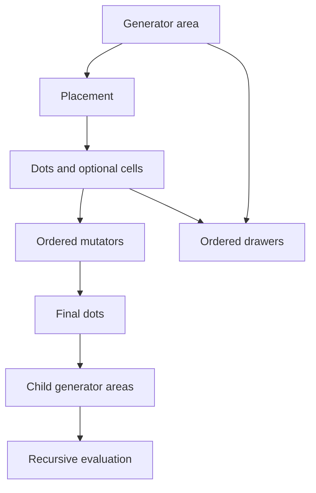

# Dot Foundry — Complete Recreation and Extension Specification

**Status:** Normative implementation specification  
**Reference:** Current Dot Foundry contained-HTML prototype  
**Target:** A visually and behaviorally equivalent desktop app in any language or framework  
**Scope:** Generator areas, placements, selectors, mutators, drawers, hierarchy, UI, gizmos, persistence, and export

This document defines Dot Foundry closely enough for an independent team to recreate it without consulting the source. **MUST** is required for conformity, **SHOULD** is the preferred implementation, and **MAY** is optional when it does not alter the documented behavior.

One deliberate requirement is newer than the reference HTML: **double-clicking any numeric slider MUST restore its default value.** See §14.

---

## 1. Product definition

Dot Foundry is a desktop-first procedural composition laboratory with no domain concepts such as buildings, windows, roads, or vegetation. Its primitives are deliberately generic:

1. A **Generator** owns an area.
2. Its **Placement module** produces dots and may also produce cells.
3. **Selectors** calculate reusable weights from `0` to `1` for those dots.
4. Ordered **Mutators** move or remove dots, optionally through a Selector.
5. Ordered **Drawers** render Generator Areas or Placement Cells, optionally through a Selector.
6. Every surviving dot may instantiate a child Generator.



### 1.1 Design principles

- **Generic before semantic.** A skyline is a configuration, not a special generator type.
- **Containment supplies coordinates, not clipping.** A child is positioned from a parent area or cell but may extend beyond it. This allows tall boxes to grow through another row.
- **Determinism.** The same complete state and seed produce the same output.
- **Weighted selection.** A Selector only reports influence; each consumer decides how to use it.
- **Ordered pipelines.** Mutator and Drawer order matters and is editable.
- **Contextual controls.** The Inspector only shows controls relevant to the current mode.
- **Visible process.** Every module may draw a preview gizmo. Hover-only gizmos are the default.
- **Extensibility.** Module types own defaults, controls, evaluation, migration, and gizmos.

---

## 2. Concepts and data carried at runtime

### 2.1 Frame

The **Frame** is the fixed square output canvas. Its normalized coordinates are left/top `0`, right/bottom `1`, center `(0.5,0.5)`. The reference raster is `900 × 900` pixels. Procedural geometry remains normalized until rendering.

### 2.2 Generator Area

```text
Area {
  centerX, centerY        normalized world coordinates
  width, height          normalized world dimensions
  rotation               radians in world space
  shape                  rectangle | ellipse | diamond
  anchorX, anchorY       attached point in world space
  instanceIndex          deterministic runtime index
}
```

The oriented rectangle defines local coordinates. `shape` determines membership. An area may extend outside its parent and the Frame; only final rasterization is clipped by the Frame.

### 2.3 Dot

```text
Dot {
  x, y                   normalized world position
  localX, localY         original local position
  stableIndex            deterministic index in the area
  sourceArea
  cellWidth?             optional normalized cell width
  cellHeight?            optional normalized cell height
  cellRotation?          optional world rotation
}
```

Grid and Box Row provide cells. Radial Grid does not. A cell remains attached to a dot through mutation: moving the dot moves its cell center, while size and rotation stay unchanged.

### 2.4 Selector, Mutator, Drawer

- A **Selector** is a reusable scalar field returning `weight ∈ [0,1]`. It never changes state by itself.
- A **Mutator** consumes an ordered dot list and produces a replacement list plus transient gizmo traces.
- A **Drawer** paints visual geometry after dot evaluation. It does not move dots or affect child instantiation.

### 2.5 Hierarchy

Every non-root Generator definition is instantiated from surviving parent dots. One definition may therefore have many evaluated Areas. The lower-left tree shows definitions, not individual runtime instances.

---

## 3. Module architecture

A production recreation MUST expose module types through registries rather than hardcoding all behavior into the editor.

| Category | Per Generator | Input | Output |
|---|---:|---|---|
| Placement | exactly one | Generator Area | base dots and optional cells |
| Selector | zero or more | Dot + Area | weight `0..1` |
| Mutator | zero or more, ordered | current dots + Selector weights | dots + trace |
| Drawer | zero or more, ordered | Areas or eligible cells | rendered pixels + targets |

### 3.1 Required module contract

```text
ModuleDefinition {
  typeId                     stable serialized identifier
  category                   placement | selector | mutator | drawer
  displayName
  createDefaults(context)    complete new configuration
  migrate(configuration)     supply later fields without overwriting data
  controlSchema(configuration, context)
  evaluate(category-specific inputs)
  buildGizmo(runtime data)
}
```

Every control schema entry MUST define a stable property key, label, control kind, minimum/maximum/step if numeric, default or context-sensitive default resolver, value formatter, visibility predicate, and whether the change requires reevaluation. This schema is the source of truth for the Inspector and slider reset.

### 3.2 IDs and references

Generators, Selectors, Mutators, and Drawers have unique stable IDs. Selector references use IDs, never list indices. A suitable implementation is `prefix + "_" + monotonicallyIncreasingCounterInBase36`. IDs need only be unique within a document. Duplicating a subtree regenerates all IDs.

A robust app SHOULD preserve unknown serialized module data and display it as unavailable rather than delete or reinterpret it.

---

## 4. Persistent schema and defaults

```text
DocumentState {
  seed
  selectedGeneratorId
  gizmoMode                hover | selected | all | off
  root                     GeneratorDefinition
}

GeneratorDefinition {
  id, name, enabled
  color, dotSize, showDots
  shape, sizeXPercent, sizeYPercent, rotationDegrees, anchor, areaBasis
  spawnEvery, spawnChancePercent, maximumInstances
  placement
  selectors[]
  mutators[]
  drawers[]
  children[]
}
```

The local persistence key is `dotFoundry.v1`. The reference payload has no explicit format-version field. An implementation MAY add non-visible version metadata for migration, but it must not alter behavior. The selected internal module is transient and returns to Generator Area after reload; the selected Generator is persistent.

### 4.1 Generator defaults

| Property | Root | Child |
|---|---:|---:|
| Name | Root Frame | Generator |
| Enabled | true | true |
| Dot color | `#70e1a1` | `#62d8ff` |
| Dot size | 4 px | 3 px |
| Dot output | on | on |
| Shape | Rectangle | Ellipse |
| Width | 100% | 22% |
| Height | 100% | 22% |
| Rotation | 0° | 0° |
| Anchor | Center | Center |
| Area basis | Parent | Parent |
| Use every Nth dot | 1 | 1 |
| Spawn chance | 100% | 100% |
| Instance limit | 1 | 80 |
| Lists | empty | empty |

The initial Placement is Grid (§8.1).

### 4.2 Migration

Loading MUST recursively normalize state and add missing anchor, area basis, dimensions, rotation, complete selected-Placement defaults, Box Row fields, Drawer arrays, Drawer fields, and fill-list data. It must never reorder modules or overwrite existing values. If loading/parsing fails, use the default scene in §20.

---

## 5. Geometry and anchors

### 5.1 Local coordinates and shape membership

An Area's local rectangle spans `−0.5..+0.5` on both axes.

| Shape | A point `(x,y)` is inside when |
|---|---|
| Rectangle | `abs(x) ≤ 0.5 AND abs(y) ≤ 0.5` |
| Ellipse | `4x² + 4y² ≤ 1` |
| Diamond | `2(abs(x) + abs(y)) ≤ 1` |

`edgeDepth` is zero at the boundary, rises toward the center, and is clamped to `[0,1]`:

| Shape | Expression before clamping |
|---|---|
| Rectangle | `2 × min(0.5−abs(x), 0.5−abs(y))` |
| Ellipse | `1 − sqrt(4x² + 4y²)` |
| Diamond | `1 − 2(abs(x) + abs(y))` |

### 5.2 Transforms

The reference uses an anisotropic point transform: it rotates the normalized local coordinate first, then scales world X by width and world Y by height. A literal recreation MUST use:

```text
worldX = cx + (lx×cos(r) − ly×sin(r)) × w
worldY = cy + (lx×sin(r) + ly×cos(r)) × h
```

The selector-side inverse used by the reference is:

```text
dx = worldX−cx
dy = worldY−cy
localX = (dx×cos(−r) − dy×sin(−r)) / w
localY = (dx×sin(−r) + dy×cos(−r)) / h
```

Area and Drawer outlines use the ordinary graphics transform: translate to center, rotate, then draw a width-by-height local shape. Consequently, rotated non-square point fields can differ slightly from their drawn outline. This is existing 1:1 behavior, not additional clipping.

### 5.3 Nine anchors

| Anchor | Local X | Local Y |
|---|---:|---:|
| Top left | −0.5 | −0.5 |
| Top | 0 | −0.5 |
| Top right | +0.5 | −0.5 |
| Left | −0.5 | 0 |
| Center | 0 | 0 |
| Right | +0.5 | 0 |
| Bottom left | −0.5 | +0.5 |
| Bottom | 0 | +0.5 |
| Bottom right | +0.5 | +0.5 |

Attach the chosen anchor to target `(tx,ty)` by rotating `(anchorX×width, anchorY×height)` and subtracting that vector from the target. Child world rotation equals basis rotation plus the child's configured rotation.

### 5.4 Root Area

The fixed Frame is the root basis: center `(0.5,0.5)`, size `(1,1)`, rotation `0`, Rectangle. The root Generator Area is editable from `2..100%` width and height. Its selected anchor attaches to the corresponding anchor of the fixed Frame. Thus a 60%-high root with Bottom anchor occupies the bottom 60% of the Frame.

### 5.5 Child basis, overflow, and overlap

A child uses either:

- **Parent generator area**, or
- **Placement cell**, available when its parent uses Grid or Box Row.

The parent dot is always the attachment target. The basis supplies scale and rotation.

Area construction MUST NOT clip a child to its parent area or cell. Child width may reach `200%` and height `600%` of its basis. A bottom-anchored child grows upward from the parent dot. Box Row may create cells taller than its Area. Only the fixed Frame clips final raster output. Later siblings and later rows draw in front of earlier ones.

---

## 6. Determinism

All random values derive from saved seeds and stable indices; evaluation must never call an ambient random generator.

```text
function hash01(a, b, c):
  x = int32(a)
      XOR int32Multiply(int32(b) + 0x9e3779b9, 0x85ebca6b)
      XOR int32Multiply(int32(c) + 17, 0xc2b2ae35)
  x = x XOR unsignedShiftRight(x,16)
  x = int32Multiply(x,0x7feb352d)
  x = x XOR unsignedShiftRight(x,15)
  x = int32Multiply(x,0x846ca68b)
  x = x XOR unsignedShiftRight(x,16)
  return unsigned32(x) / 4294967296
```

Clicking **New seed** assigns an integer in `0..999,998`, reevaluates, redraws, updates the chip, and saves.

---

## 7. Evaluation pipeline

```text
evaluateDocument(root):
  clear caches and statistics
  fixedFrame = Area(center .5,.5; size 1,1; rotation 0)
  rootArea = constructArea(root, fixedFrame, fixedFrame.anchor(root.anchor))
  evaluateGenerator(root, [rootArea])

evaluateGenerator(generator, inputAreas):
  if not generator.enabled: stop this complete subtree
  areas = first generator.maximumInstances inputAreas

  for each area with deterministic instanceIndex:
    localDots = placement.evaluate(area)
    baseDots = transform localDots into world coordinates
    currentDots = baseDots
    for enabled mutator in displayed order:
      currentDots, trace = mutator.apply(currentDots, area, selectors)
    retain base dots, final dots, and traces in runtime cache

  for child definition in displayed order:
    walk final parent dots in stable order
    accept only index modulo spawnEvery == 0
    accept only deterministic random <= spawnChance/100
    stop at child.maximumInstances
    choose parent-area or available cell basis
    construct anchored child area without parent clipping
    recursively evaluate child with collected areas
```

Child spawn chance uses `hash01(globalSeed + 37, dotIndex, length(childId))`. **Use every Nth dot** ranges `1..12`; Spawn chance `0..100%`; Instance limit `1..250`.

The top bar reports visible output dots from enabled Generators with Dot output enabled, total evaluated Generator Areas, and seed. Each tree row reports that definition's total evaluated dots, Drawer count when nonzero, and child count.

---

## 8. Placement modules

Each Generator has exactly one Placement module. The Method selector switches the registered type and shows only that type's controls.

### 8.1 Grid

**Purpose:** Produce an X-by-Y lattice clipped to the Generator shape. Every dot has cell metadata.

| Control | Range | Step | Default |
|---|---:|---:|---:|
| Columns | 1..28 | 1 | Root 8; child 4 |
| Rows | 1..28 | 1 | Root 7; child 4 |
| X line gap | 0..80% | 1 | 0 |
| Y line gap | 0..80% | 1 | 0 |
| Skew X | −80..80% | 1 | 0 |
| Skew Y | −80..80% | 1 | 0 |
| Grid rotation | −180..180° | 1 | 0 |
| Offset X | −50..50% | 1 | 0 |
| Offset Y | −50..50% | 1 | 0 |

```text
columns = max(1, floor(configuredColumns))
rows = max(1, floor(configuredRows))
spanX = 0.9 + xLineGap/180
spanY = 0.9 + yLineGap/180
cellWidth = min(0.9, spanX/columns) × 0.8
cellHeight = min(0.9, spanY/rows) × 0.8

for row:
  y = rows == 1 ? 0 : (row/(rows−1)−0.5) × spanY
  rowNorm = rows == 1 ? 0 : row/(rows−1)−0.5
  for column:
    x = columns == 1 ? 0 : (column/(columns−1)−0.5) × spanX
    colNorm = columns == 1 ? 0 : column/(columns−1)−0.5
    x += rowNorm × skewX/100
    y += colNorm × skewY/100
    rotate by gridRotation
    add offsetX/100 and offsetY/100
    if shapeInside(x,y): emit dot and cell
```

The “line gap” controls expand lattice span; preserve this exact behavior. Cell rotation is Area rotation plus Grid rotation.

### 8.2 Box Row

**Purpose:** Pack variable-width boxes left-to-right. Each box produces one center dot and exact cell metadata. This is the generic basis for building masses.

Inspector help:

> Packs boxes across the area's width. With outside growth enabled, top/centre/bottom acts as a baseline and boxes may extend beyond the Generator Area.

| Control | Range | Step | Default |
|---|---:|---:|---:|
| Minimum width | 1..50% | 0.5 | 8 |
| Maximum width | 1..60% | 0.5 | 18 |
| Height basis | Generator area / Multiple of box width | — | Generator area |
| Minimum height, area basis | 1..1000% if overflow; else 1..100% | 1 | 35 |
| Maximum height, area basis | same | 1 | 92 |
| Minimum height, width basis | 0.1..10× width | 0.1 | 1 |
| Maximum height, width basis | 0.1..10× width | 0.1 | 3 |
| Grow outside area | on/off | — | on |
| Equal gap | 0..20% | 0.5 | 2 |
| Edge padding | 0..25% | 0.5 | 2 |
| Vertical anchor | Bottom / Centre / Top | — | Bottom |
| Variation seed | 0..999 | 1 | 101 |

Changing Height basis swaps the two height controls and units. Changing Grow outside area changes the maximum of area-relative height sliders.

```text
padding = clamp(edgePadding/100, 0, 0.45)
gap = clamp(equalGap/100, 0, 0.4)
minWidth,maxWidth = sorted(width percentages / 100)
right = 0.5 - padding
x = -0.5 + padding
boxIndex = 0

while x + minWidth <= right and boxIndex < 300:
  width = lerp(minWidth, maxWidth,
               hash01(globalSeed+variationSeed, area.instanceIndex, boxIndex))
  width = min(width, right-x)
  if width < minWidth×0.70: break

  hRandom = hash01(globalSeed+variationSeed+17, area.instanceIndex, boxIndex)
  if heightBasis == boxWidth:
    aspect = lerp(sortedMinAspect, sortedMaxAspect, hRandom)
    height = width × (area.width/max(epsilon,area.height)) × aspect
  else:
    height = lerp(sortedMinHeight, sortedMaxHeight, hRandom)

  if not growOutsideArea: height = min(height, 1−2×padding)

  if verticalAnchor == top:    y = −0.5 + padding + height/2
  if verticalAnchor == centre: y = 0
  if verticalAnchor == bottom: y =  0.5 − padding − height/2

  emit dot(x+width/2,y) with cell(width,height)
  x += width + gap
  boxIndex += 1
```

Box Row uses the bounding width and does not reject cells whose corners leave an ellipse or diamond. With Grow outside enabled, the anchor is a baseline; height is uncapped and boxes may grow across other rows.

### 8.3 Radial Grid

**Purpose:** Produce rings of points. It does not provide cells.

| Control | Range | Step | Initial default |
|---|---:|---:|---:|
| Flow | Center→edge / Edge→center | — | Center→edge |
| Rings | 1..14 | 1 | 3 |
| Base dots / ring | 1..36 | 1 | 7 |
| Inner radius | 0..95% | 1 | 18 |
| Outer radius | 5..100% | 1 | 88 |
| Ring spacing curve | −100..100 | 1 | 0 |
| Outer density scale | −90..180% | 1 | 45 |
| Phase | 0..100% | 1 | 8 |
| Rotation | −180..180° | 1 | 0 |
| Center dot | on/off | — | on |

These are the default Radial Clusters values and MUST initialize a newly selected Radial Grid type.

```text
if centerDot: emit (0,0)
n = max(1,floor(rings))
for ringIndex in 0..<n:
  t = n == 1 ? 0.5 : ringIndex/(n−1)
  orderedT = edgeToCenter ? 1−t : t
  curvedT = orderedT ^ (2^(spacingCurve/55))
  radius = lerp(innerRadius/200, outerRadius/200, curvedT)
  density = 1 + outerDensityScale/100 × (t−0.5)×2
  count = max(1,round(baseDotsPerRing×density))
  for i in 0..<count:
    angle = i/count×2π + phase/100×2π + rotation
    point = radius×(cos(angle),sin(angle))
    if shapeInside(point): emit point
```

---

## 9. Selector modules

Selectors are listed in edit order but independently referenced by ID. Every consumer also offers **All dots**, a built-in constant weight of `1`. A missing or disabled referenced Selector also resolves to `1`.

### 9.1 Margin selector

**Default name:** Edge margin.

| Control | Range | Step | Default |
|---|---:|---:|---:|
| Band width | 0..50% | 1 | 22 |
| Softness | 0..40% | 1 | 8 |
| Edge band value | 0..100% | 1 | 100 |
| Inner core value | 0..100% | 1 | 0 |

For edge depth `d`:

```text
threshold = bandWidth/50
soft = max(0.001,softness/100)
bandWeight = 1 − clamp((d−threshold+soft)/(2×soft),0,1)
result = lerp(innerCoreValue/100,edgeBandValue/100,bandWeight)
```

The demo's **Safe frame** uses band width `8`, softness `3`, edge value `0`, core value `100`.

### 9.2 Gradient selector

**Default name:** Directional gradient.

| Control | Range | Step | Default |
|---|---:|---:|---:|
| Field | Linear / Wave | — | Linear |
| Angle | −180..180° | 1 | 0 |
| Offset | −100..100% | 1 | 0 |
| Contrast | 10..250% | 1 | 100 |
| Frequency, Wave only | 1..8 | 0.1 | 2 |
| Phase, Wave only | 0..100% | 1 | 0 |
| Invert | on/off | — | off |

```text
local = inverseTransform(dot,area)
projection = (local.x×cos(angle)+local.y×sin(angle))×1.42 + offset/100
linear weight = clamp(0.5 + projection×contrast/100,0,1)
wave weight = 0.5 + 0.5×sin((projection×frequency+phase/100)×2π)
if invert: weight = 1−weight
```

### 9.3 Random selector

**Default name:** Random mask.

| Control | Range | Step | Default |
|---|---:|---:|---:|
| Selected amount | 0..100% | 1 | 55 |
| Seed offset | 0..999 | 1 | 19 |

It returns binary weight:

```text
hash01(globalSeed+selectorSeed,
       currentPointIndex+area.instanceIndex×997,
       area.instanceIndex)
  < amount/100 ? 1 : 0
```

---

## 10. Mutator modules

Mutators run in displayed order. Each card has Up, Down, and Remove. Reordering causes full reevaluation.

### 10.1 Nudge

**Default name:** Nudge.

| Control | Range | Step | Default |
|---|---:|---:|---:|
| Selector | named / All dots | — | All dots |
| Maximum nudge | 0..20% | 0.1 | 3 |
| Seed offset | 0..999 | 1 | 31 |
| Direction bias | 0..100% | 1 | 0 |
| Bias angle, if bias > 0 | −180..180° | 1 | 0 |

Generate deterministic random angle and magnitude. Maximum world displacement is `strength/100 × min(area.width,area.height) × selectorWeight`; magnitude multiplies this by `0.35 + 0.65×randomMagnitude`. Blend the random unit direction toward the bias-angle direction by `bias/100`, normalize through `atan2`, and move by the magnitude.

### 10.2 Warp field

**Default name:** Warp field.

Common controls:

| Control | Range | Step | Default |
|---|---:|---:|---:|
| Selector | named / All dots | — | All dots |
| Field source | Point centers / Parallel lines | — | Point centers |
| Force | Pull / cluster / Push / disperse | — | Pull / cluster |
| Strength | 0..25% | 0.1 | 7 |

Point centers:

| Control | Range | Step | Default |
|---|---:|---:|---:|
| Centers | 1..8 | 1 | 2 |
| Influence radius | 5..120% | 1 | 45 |
| Seed offset | 0..999 | 1 | 71 |

Place deterministic centers in the central `75% × 75%` of the Area. Apply centers sequentially. `reach = radius/100 × max(area.width,area.height)`, `falloff = clamp(1−distance/reach,0,1)`, and displacement is `strength/100 × min(area.width,area.height) × falloff × selectorWeight`. Pull moves toward; Push moves away.

Parallel lines:

| Control | Range | Step | Default |
|---|---:|---:|---:|
| Line angle | −180..180° | 1 | 0 |
| Line spacing | 5..80% | 1 | 24 |

Project the dot onto the normal of the selected line angle, find the nearest regularly spaced line, and move toward/away with triangular falloff reaching zero halfway between lines.

### 10.3 Cull

**Default name:** Cull.

| Control | Choices/range | Default |
|---|---|---|
| Selector | named / All dots | All dots |
| Cull action | Cull unselected / Cull selected | Cull unselected |
| Seed offset | 0..999 | 43 |

For weight `w` and stable random `r`, Cull selected removes when `r < w`; Cull unselected removes when `r > w`.

### 10.4 Trace contract

Each Mutator records transient source Area, before dots, after dots, removed dots, and vectors/field sources needed by its gizmo. Trace data is never persisted.

---

## 11. Drawer modules

Drawers add visuals without affecting dots or descendants. They render after evaluation and before dot markers/gizmos, in displayed order.

### 11.1 Fill Drawer

**Default name:** Fill shapes. **Type:** `fill`.

```text
enabled=true; target=generatorAreas; selector=all; use=selected
threshold=50%; cellScaleX=62%; cellScaleY=62%; cellShape=rectangle
fillSource=single; fillType=flat
colorA=#26384a; colorB=#6bb6d9; angle=90°
opacity=100%; variationSeed=211
```

Target controls:

| Control | Values/range | Visibility |
|---|---|---|
| Draw target | Generator areas / Placement cells | always |
| Selector | named / All dots | cells only |
| Use | Selected / Inverse | cells only |
| Threshold | 0..100% | cells only |
| Cell shape | Rectangle / Ellipse / Diamond | cells only |
| Cell width | 1..120% | cells only |
| Cell height | 1..120% | cells only |
| Opacity | 0..100% | always |

For cells, consider final dots with cell metadata. Evaluate selector weight, invert when Use is Inverse, and render when `weight ≥ threshold/100`. Center at the final dot, retain original cell rotation, and scale width/height by their respective percentages.

The **Fill source** control selects Single fill or Random from list. **Single fill** exposes a **Fill style** control with Flat/Gradient. Flat shows one color. Gradient shows Color A, Color B, and **Gradient angle** `−180..180°`.

**Random from list** exposes variation seed `0..999`, an ordered editable fill list, Add Flat, and Add Gradient. Per-row Remove cannot delete the final entry.

| Default entry | Style | A | B | Angle |
|---:|---|---|---|---:|
| 1 | Flat | `#26384a` | same | — |
| 2 | Gradient | `#293449` | `#79b4d2` | 90° |
| 3 | Gradient | `#463247` | `#d38d78` | 90° |

New Flat entries use `#667788`. New Gradient entries use `#293449 → #79b4d2` at `90°`. Choose list entries deterministically from global seed, variation seed, target index, and Drawer identity.

For a gradient, rotate its axis through target center. Use half of the target bounding-box diagonal as extent, with A at the negative endpoint and B at the positive endpoint. Apply opacity to the complete target.

---

## 12. Render order and clipping

The exact render stack is:

1. Clear the `900 × 900` canvas.
2. Paint background `#0c1017`.
3. Paint a 10-by-10 guide grid in `#273140`.
4. Traverse Generator definitions depth first in hierarchy order, rendering each enabled Generator's Drawers in displayed order.
5. Restroke the fixed Frame in `#64748b`, 2 px.
6. Draw active gizmos.
7. Draw enabled visible dot markers.

Within one Generator, targets draw in stable evaluation order. Later siblings cover earlier siblings; descendants render after their parent. This is what allows a foreground row of boxes to overlap a background row.

The fixed Frame is the only mandatory clip. Areas and cells are never clipped to their parents.

Visible dots use their Generator color, configured marker radius `1..8 px`, and a 4 px same-color glow. Dots with centers outside `[0,1] × [0,1]` are skipped. Turning Dot output off only hides markers; those dots still drive children and Drawers.

PNG export follows the same render path, including background, guide grid, frame, Drawers, and visible dots. It temporarily hides gizmos and downloads `dot-foundry-{seed}.png`, then restores the prior gizmo mode.

---

## 13. Gizmo system

### 13.1 Modes

The Preview toolbar offers:

1. **Hovered module** — default; only the module/card under the pointer.
2. **Selected module** — the selected module.
3. **All modules** — all Placement, Selector, Mutator, and Drawer gizmos; the Generator Area gizmo remains limited to the selected Generator.
4. **Off** — none.

Hover mode is central to preventing visual overload. Leaving the card removes its gizmo. The selected Generator and selected internal module IDs are tracked separately. Clicking a card's non-interactive header both selects it and toggles its collapsed state. Active hovered cards receive a cyan outline.

### 13.2 Gizmos by category

| Category | Exact visualization | Detail cap |
|---|---|---:|
| Generator Area | dashed shape outline; anchor circle/cross; Generator color | 120 areas |
| Grid | Area outlines and nominal row/column guides using spacing; dots themselves show skew, Placement rotation, and offset | 60 areas |
| Radial Grid | Area outlines, rings, center | 60 areas |
| Box Row | Area outlines and dashed cell rectangles | 60 areas |
| Selector | amber dot overlays; alpha/size from weight | 2,200 dots; 50 areas |
| Margin | Selector dots plus boundary-band outline | same |
| Gradient | Selector dots plus direction arrow/wave orientation | same |
| Nudge/Warp | before-to-after vectors | 50 traces; 80 vectors |
| Cull | removed dots as red X marks | 50 traces; 80 marks |
| Point Warp | vectors plus center crosses/radius circles | same |
| Line Warp | vectors plus dashed parallel field lines | same |
| Drawer | magenta dashed eligible-target outlines | 220 targets |

Caps affect only preview gizmos, never generation or export.

---

## 14. Sliders and required double-click reset

All range sliders use accent `#55c9ef` and display a formatted value in the rightmost part of their row.

Dragging a slider MUST update its label and bound state immediately, reevaluate when needed, coalesce drawing through an animation-frame-equivalent scheduler, update counts/tree metadata, and persist. Conditional controls must appear/disappear without losing the new value.

### 14.1 Required addition

**Double-clicking every numeric slider MUST restore the registered default for that property.** This is required even though the current HTML reference does not yet implement it.

```text
onSliderDoubleClick(slider):
  schema = slider.boundControlSchema
  defaultValue = schema.resolveDefault(currentGeneratorAndModuleContext)
  slider.value = clampAndQuantize(defaultValue,schema.min,schema.max,schema.step)
  dispatch the same state-update path used by live slider input
```

Requirements:

- Update the formatted value immediately.
- Perform the same reevaluation, redraw, metadata update, and persistence as dragging.
- Do not hardcode defaults in event handlers; resolve them through module/control schemas.
- Do not select page text or trigger Preview Fit.
- Provide a tooltip such as `Double-click to reset to {formatted default}`.
- Resolve context-sensitive Generator defaults by role: root or child.
- Use registered type defaults from §§8–11.
- A dynamic fill-list gradient-angle slider resets to `90°`.
- Migrated out-of-range values reset to the current schema default.
- Duplicated modules reset to type defaults, not their values at duplication time.
- Keep default metadata available even while a conditional control is hidden.

If an undo system is later added, reset is one conceptual edit.

---

## 15. Desktop UI and exact visual layout

### 15.1 Visual tokens

| Token | Value |
|---|---|
| App background | `#0b0d12` |
| Panel | `#11151d` |
| Card | `#171c26` |
| Raised/tertiary | `#1d2430` |
| Border | `#2a3342` |
| Strong border | `#39465a` |
| Text | `#edf2f7` |
| Muted | `#8d99aa` |
| Cyan | `#62d8ff` |
| Violet | `#a78bfa` |
| Amber | `#ffcc66` |
| Red | `#ff6b7a` |
| Green | `#70e1a1` |
| Shadow | `0 12px 34px rgba(0,0,0,.53)` |
| Radius | 10 px |
| Font | Inter, then system UI fallbacks |
| Base type size | 13 px |

The page fills the application window and does not scroll as a whole.

### 15.2 Primary geometry

```text
app rows: 48px, remaining space
workspace columns: minmax(0,1.18fr), minmax(320px,0.82fr)
left rows: minmax(250px,1fr), minmax(170px,0.42fr)
```

The result is a roughly 59% left work area and 41% right Inspector. The left side contains Preview above and Generator Hierarchy below. The Inspector has a left border; the hierarchy has a top border.

Exact component metrics:

| Component | Metrics |
|---|---|
| Top bar | background `#0e1117`; horizontal padding 14 px; item gap 12 px |
| Panel header | background `#10141b`; height 42 px; padding `0 12px`; gap 8 px |
| Preview viewport | background `#0a0c10`; `#161b24` grid lines every 24 px; overflow clipped |
| Canvas shell | one-pixel `#364153` ring; shadow `0 18px 48px #000a` |
| Hierarchy scroller | padding `7px 8px 18px` |
| Tree row | 40 px high; columns `24px 22px minmax(0,1fr) auto`; gap 5 px; padding `0 7px`; radius 7 px |
| Inspector | background `#10141b`; independent vertical scrolling |
| Inspector header | sticky; padding `12px 14px`; background `#11161eF5`; 8 px blur |
| Inspector body | padding `10px 11px 80px` |
| Card header | minimum 40 px high; padding `7px 10px`; gap 8 px |
| Card body | padding `5px 10px 12px`; top border 1 px |
| Callout | padding `9px 10px`; radius 8 px; border `#29495b`; background `#11232d` |

### 15.3 Top bar

From left to right:

1. Brand block: **Dot Foundry**, then `GENERATOR FUNDAMENTALS LAB` in uppercase, letter-spaced muted blue.
2. Pills: `{count} dots`, `{count} generator areas`, `seed {value}`.
3. Flexible spacer.
4. **Export PNG**.
5. **Reset demo**.

The bar is 48 px high with bottom border and vertically centered controls.

### 15.4 Preview

Its header is 42 px high. Left: uppercase letter-spaced `FRAME`. Right:

1. Gizmos label + select.
2. Minus zoom.
3. Zoom percentage.
4. Plus zoom.
5. Fit.
6. New seed.

The viewport fills the remaining space, clips overflow, and has a 24 px dark grid background. A square canvas is centered when fitted and transformed for zoom/pan.

Bottom-left overlay: compact legend of enabled dot-output Generators, each with color dot and name. Bottom-right: `Wheel zoom · Drag pan · 0 fit`, with Wheel, Drag, and 0 styled as keys.

### 15.5 Generator Hierarchy

The header is 42 px. Left: `GENERATOR HIERARCHY`. Right, in order:

1. `+ Child generator` primary button.
2. Up.
3. Down.
4. Duplicate.
5. Delete, danger styling.

The body scrolls. Rows are approximately 40 px high and indent 20 px per depth. Each contains disclosure marker, enable/visibility control, Generator color dot, name, second-line metadata, and right-aligned child count when nonzero. Metadata is Placement name, output dot count, and Drawer count if nonzero.

The disclosure marker is informational in the current app; Generator tree branches are always expanded.

Selected row: background `#172631`, border `#3e6174`, rounded. Root cannot move, duplicate, or delete. Up/Down disable at sibling boundaries.

### 15.6 Inspector

The right panel scrolls independently and has a sticky header containing editable Generator name, enabled toggle, and a metadata row for Root/Child, child count, and output dot count.

Below it is this exact callout:

> Placement creates dots and optional cells. Mutators alter the dots; Drawers add visuals. A child can inherit its parent area or the exact cell surrounding its parent dot.

Cards appear in fixed order:

1. Generator Area.
2. Dot Placement.
3. Selectors heading/list/Add.
4. Mutators heading/list/Add.
5. Drawers heading/list/Add.

Cards use Card background, 1 px Border, 10 px radius, and 8 px vertical separation. A clickable header contains disclosure chevron, name, right-side category label, and enable toggle when applicable. Disabled modules preserve settings, hide controls, and show a short disabled message. Active hover/selected cards have cyan outline. Collapse state is session-only.

### 15.7 Inspector field geometry

```text
field row columns: minmax(115px,0.9fr), minmax(150px,1.25fr)
column gap: 12px
minimum row height: 35px
```

Slider control areas contain flexible track plus right-aligned value. Labels use pale blue; micro headings/categories use uppercase letter-spaced muted blue.

Buttons: background `#171d27`, border `#39465a`, radius 7 px; hover border `#66758b`, background `#202937`; pressed shifts down 1 px; disabled opacity `.32`. Primary buttons are `#23556b` with border `#3483a0`. Danger text is `#ffabb4`.

Toggle: `34 × 19 px`; off `#323b49`; on `#236f88`; 13 px thumb.

Anchor picker: 3×3 grid of 25 px buttons, 3 px gap; active background `#183544`, border `#48b9df`; anchor name to its right.

Color controls pair the native color input with hexadecimal text.

Fill-list row columns are `92px 38px 38px minmax(70px,1fr) 27px`, gap 5 px, padding 6 px: style, A, B, angle/flexible field, Remove.

### 15.8 Responsive fallbacks

The app remains desktop-first but preserves:

- At `≤1050 px`: workspace columns `minmax(0,1fr) minmax(300px,38%)`; statistic chips hide; Inspector spacing tightens; fill rows become `80px 34px 34px minmax(55px,1fr) 27px`.
- At `≤760 px`: workspace becomes one column; Inspector becomes a fixed right overlay from top 48 px to bottom, width `min(380px,88vw)`, with strong left shadow; the left side loses its right border; Preview overlays reposition.

This is fallback behavior, not a separate mobile design.

---

## 16. Exact Inspector structure

### 16.1 Generator Area card

Always show:

- Dot output toggle.
- Dot color plus hex.
- Dot size `1..8 px`, step `0.5`.
- `AREA INSIDE THE FIXED FRAME` for root, or `AREA ATTACHED TO EACH PARENT DOT` for child.
- Shape: Rectangle/Ellipse/Diamond.
- Width: root `2..100%`, child `2..200%`, step 1.
- Height: root `2..100%`, child `2..600%`, step 1.
- nine-point Anchor.
- Rotation `−180..180°`, step 1.

Child only:

- Size relative to Parent generator area, or Placement cell when the immediate parent Placement is Grid/Box Row.
- `INSTANTIATION FILTER`.
- Use every Nth dot `1..12`.
- Spawn chance `0..100%`.
- Instance limit `1..250`.

### 16.2 Dot Placement card

Show Method first, then rebuild from that type's schema. Never show dormant controls from another method.

### 16.3 Selector section

Show Selector cards then **+ Selector**. Menu: Margin selector, Gradient selector, Random selector. Adding creates defaults, selects the module, evaluates, draws, and saves.

### 16.4 Mutator section

Show cards then **+ Mutator**. Menu: Nudge, Warp field, Cull. Each card has reorder/removal. Selector menus update after Selector rename/add/remove.

### 16.5 Drawer section

Show Drawer cards then **+ Fill Drawer**. Each card has reorder/removal. Deleting a Selector retargets every referencing Mutator and Drawer to **All dots**.

Disabled Selector references behave as All dots. Disabled Mutators/Drawers do nothing. A disabled Generator stops its entire subtree. Settings remain intact.

### 16.6 Menus and input

- Add menus close after selection, outside click, or Escape.
- Interactive header controls must not collapse their card.
- Names commit on change/blur and update tree labels.
- Sliders/colors update live.
- Structural mode switches rebuild relevant controls without losing state.

---

## 17. Preview navigation

Fit size is `max(64px,min(viewportWidth−32px,viewportHeight−32px))`. Fit sets zoom to 100% and pan `(0,0)`.

- Zoom range `25%..800%`.
- Plus/minus factor `1.25`.
- Wheel factor `exp(−deltaY×0.0015)`.
- Wheel zoom is cursor anchored.
- `+`/`=` zoom in, `−` zoom out, `0` fit.
- Ignore shortcuts while input/select/textarea has focus.
- Click-drag pans.
- Double-click Preview fits.

Clamp pan:

```text
scaled = fittedSize×zoom
maxPanX = max(0,(scaled−viewportWidth)/2+16)
maxPanY = max(0,(scaled−viewportHeight)/2+16)
```

Pan/zoom are not persisted.

---

## 18. Hierarchy commands

### Add child

- Under Grid/Box Row: area basis Cell, size `100% × 100%`, Rectangle, every Nth `1`.
- Under Radial Grid: area basis Parent, size `18% × 18%`, every Nth `2`.
- Select and inspect the new child.

### Reorder

Move only among siblings. Reevaluate immediately because evaluation/render overlap changes.

### Duplicate

Duplicate the selected non-root definition and subtree, append to its sibling list, regenerate all IDs, select the copy, and append ` copy` to the selected Generator and every descendant name. Copied Mutators and Drawers reset Selector targets to All dots to prevent cross-copy references.

### Delete

Delete the selected non-root subtree immediately and select its parent. The current UI does not show a confirmation dialog. Root is protected.

### Enable

Tree visibility toggles `enabled`. Disabled definitions remain listed but contribute no areas, dots, Drawers, or descendants.

---

## 19. Persistence, reset, and export

### 19.1 Persistence

After every committed edit, serialize the Document State to `dotFoundry.v1`.

Persist hierarchy, all module settings, enabled states, names/colors, seed, selected Generator, and gizmo mode. The selected internal module is transient.

Do not persist pan/zoom, hover, runtime caches/traces, transient menus, or card collapse state.

### 19.2 Reset demo

**Reset demo** asks for confirmation, replaces hierarchy and seed with §20, selects Radial Clusters, sets Hovered-module gizmos, evaluates, redraws, and persists.

### 19.3 PNG export

Export the exact `900 × 900` canvas described in §12 with gizmos hidden and restore the gizmo mode afterward.

---

## 20. Default demonstration

Global seed is `4821`; selected Generator is **Radial Clusters**; gizmo mode is **Hovered module**.

### 20.1 Root Frame

- Root defaults, except Dot output off.
- Placement Grid: `8 × 7`, no gap/skew/rotation/offset.
- Selector **Safe frame**: Margin; width 8, softness 3, edge value 0, core value 100.
- Mutator **Loose lattice**: Nudge through Safe frame; strength 2.2, bias 18, angle −12°; other Nudge defaults unchanged.
- Children in order: Radial Clusters, Diamond Grids.

### 20.2 Radial Clusters

- color `#62d8ff`;
- Ellipse `20% × 20%`;
- every 2nd parent dot;
- spawn chance 78%;
- instance limit 24;
- Radial Grid values from §8.3;
- Selector **Light sweep**: Linear Gradient; angle −28°, offset 10%, contrast 125%;
- Mutator **Gather**: Warp, Light sweep, Point centers, Pull, strength 4.5%, one center, radius 55%, seed 12;
- Mutator **Fade out**: Cull, Light sweep, Cull unselected, seed 92.

### 20.3 Diamond Grids

- color `#ffcc66`;
- Diamond `13% × 13%`;
- every 4th parent dot;
- spawn chance 70%;
- instance limit 12;
- Grid `4 × 4`, X/Y line gaps 7%, rotation 45°, no skew/offset;
- Selector **Broken cells**: Random, amount 72%, seed 22;
- Mutator Cull, Broken cells, Cull unselected, seed 28.

The default scene has no Drawers.

---

## 21. Acceptance scenario: three rows of procedural buildings

This proves the generic design without adding a Building type.

1. Make the Root Area 60% high and Bottom anchored to confine its placement lattice to the lower 60%.
2. Set Root Placement to one-column, three-row Grid.
3. Add child Generator **Houses**.
4. Use Box Row Placement.
5. Set Vertical anchor to Bottom/grow upward.
6. Enable Grow outside area.
7. Raise maximum height beyond 100%, or use width-relative height with a tall aspect range.
8. Add a Fill Drawer targeting Placement Cells.
9. Select Flat, Gradient, or Random from list.
10. Use hierarchy/row order to determine foreground overlap.
11. Add a child Grid sized relative to each Box Row cell to create window cells.
12. Add a Margin selector to that Grid and a Fill Drawer targeting cells. Use Selected for the safe core or Inverse for the boundary.

The parent dots establish baselines; they do not clip Houses. The building/window result emerges only from generic areas, cells, anchors, selectors, and Drawers.

---

## 22. Runtime and performance

Maintain a transient cache per Generator definition:

```text
RuntimeGeneratorData {
  definition
  evaluatedAreas
  baseDots
  finalDots
  mutatorTraces
  childRuntimeReferences
}
```

Rebuild after procedural edits; never serialize it. Slider drags SHOULD update state immediately but coalesce draws into one pending animation-frame-equivalent callback.

Safety limits:

- Box Row: 300 boxes per evaluated Area.
- Child instances: user limit, maximum 250.
- Gizmos: limits in §13.

These limits do not reduce exported procedural content except where explicitly stated.

---

## 23. Accessibility

- Every control has a visible label.
- Icon-only buttons have accessible names/tooltips.
- Keyboard focus is visible.
- Disabled controls use semantic disabled state as well as opacity.
- Toggles expose checked state.
- Tree selection and Generator enabled state remain separate.
- Color markers supplement names rather than replace them.
- Gizmos can be disabled.
- Slider values have explicit text labels.
- Slider reset is discoverable through the tooltip required by §14.

---

## 24. Conformance checklist

### Architecture

- [ ] Generator definitions recursively instantiate from surviving parent dots.
- [ ] Placement, Selector, Mutator, and Drawer types are independently registered.
- [ ] Selector references are stable-ID based.
- [ ] Mutators and Drawers are ordered and editable.
- [ ] Children may use parent areas or Placement Cells as their basis.
- [ ] Child Areas are not automatically clipped.

### Geometry and modules

- [ ] Rectangle, Ellipse, and Diamond math matches §5.
- [ ] All nine anchors attach exactly.
- [ ] Root may occupy the bottom 60% of Frame.
- [ ] Child height reaches 600% of its basis.
- [ ] Bottom-anchored Box Rows grow upward across other rows.
- [ ] Grid, Box Row, and Radial Grid match §8.
- [ ] Margin, Gradient, and Random match §9.
- [ ] Nudge, Warp, and Cull match §10 and are deterministic.
- [ ] Fill Drawer supports all area/cell, selector, fill, and list features in §11.

### UI

- [ ] Top bar, Preview, hierarchy, and right Inspector match §15.
- [ ] Only relevant controls appear.
- [ ] Cards collapse, select, enable, reorder, and remove correctly.
- [ ] Hovered-module gizmos are default.
- [ ] Preview supports Fit, 25–800% zoom, cursor-centered wheel zoom, drag pan, and shortcuts.
- [ ] Every slider resets to its schema default on double-click.

### State/output

- [ ] Same state and seed produce identical results.
- [ ] Counts match enabled runtime output.
- [ ] State saves and migrates missing fields.
- [ ] Reset reproduces §20.
- [ ] PNG is 900 × 900 and excludes gizmos only.

---

## 25. Recommended implementation boundary

The procedural engine must not depend on Inspector widgets or a particular graphics API.

```text
Core model
  schema, IDs, migrations, module registries

Procedural evaluator
  transforms, placement, selection, mutation, recursion, caches

Renderer
  drawers, dots, frame, guide grid, gizmos, PNG surface

Editor presentation
  desktop layout, hierarchy, schema-driven Inspector, controls

Application services
  persistence, seed changes, export, redraw scheduling
```

The UI reads module control schemas and writes model properties. The evaluator invokes registered algorithms. The renderer consumes evaluated data plus Drawer/Gizmo registrations. A new module can therefore supply its data, controls, evaluation, and process visualization without adding domain-specific branches elsewhere.

That boundary is the essential design: Dot Foundry is not a fixed skyline tool. It is a recursive system for generating areas and dots, selecting and transforming them, and drawing generic shapes from the result.
